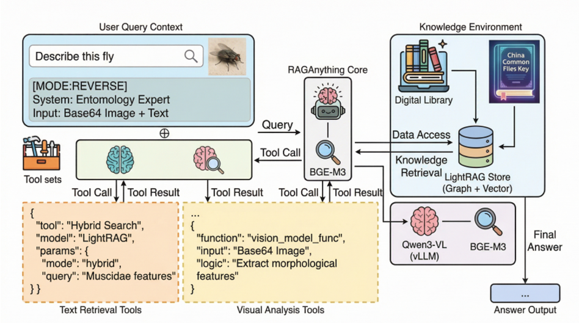

# Pervasive Learning and AI Adaptation for Entomological Vector Knowledge Retrieval

> A locally deployed, server-side RAG platform that transforms static entomological monographs into an interactive identification and learning environment.

---

## 📋 System Overview

Synanthropic flies are major disease vectors in China, yet routine identification still relies on bulky Chinese-language keys and monographs that are hard to use, slow to update, and inaccessible to many practitioners. This platform addresses these challenges by providing:

**A fully local, privacy-preserving RAG system** that ingests authoritative entomological books on an on-premise server and exposes them through an interactive Chinese conversational interface. The system currently **covers 1,671 vector species** with complete family-, genus-, and species-level identification keys.

### System Architecture

The platform integrates three core components:

1. **Dense Retrieval Engine**: Uses BAAI/bge-m3 multilingual embeddings for semantic search across document chunks
2. **Knowledge Graph**: Automatically constructed domain knowledge graph capturing taxonomic relationships, morphological traits, and identification pathways
3. **Multimodal LLM**: Qwen3-VL-32B-Instruct served via vLLM for natural language generation and reasoning

All computation runs fully on local GPUs, preserving data sovereignty while modernizing vector surveillance workflows.

---

## ✨ Key Features

### 🔍 Dual Identification Modes

#### Forward Retrieval (Key-Driven Identification)
- **Traditional dichotomous key navigation**: Follow step-by-step identification paths from family → genus → species
- **Interactive couplet explanation**: The system explains each decision point with diagnostic characteristics
- **Example query**: "Follow the key to identify genus Musca"

#### Reverse Identification (Trait-Driven Identification)
- **Feature-based species inference**: Start from observed morphological traits to find candidate taxa
- **Probabilistic ranking**: Returns plausible species with confidence scores
- **Example query**: "Which fly species have metallic blue thorax and red eyes?"

### 🎓 Pervasive Learning Design

The platform treats **every identification episode as a micro-lesson**:

- **Explanatory queries**: Ask about taxonomic concepts, morphological terminology, and diagnostic characters
- **Reasoning transparency**: View complete retrieval paths and knowledge graph traversals
- **Contextual learning**: System explains not just "what" but "why" certain traits are diagnostic

### 🤖 AI Adaptation at Three Levels

#### 1. Corpus-Level Adaptation
- Incremental ingestion of new monographs and taxonomic checklists
- Automatic entity resolution and synonym alignment
- Dynamic knowledge graph updates without service interruption

#### 2. Interaction-Level Adaptation
- Lightweight user profiling tracking expertise levels and query history
- Adaptive explanation depth (simplified for novices, technical for experts)
- Personalized follow-up question recommendations

#### 3. Community-Level Adaptation
- Expert flagging system for incorrect or ambiguous answers
- Curator review workflow for knowledge base corrections
- Aggregated statistics identifying problematic taxa for future curation

### 🌐 Multimodal Capabilities
- **Vision-Language Understanding**: Qwen3-VL processes both modalities simultaneously
- **Structured Output**: Returns identification results, key characteristics, and distribution information

### 🔒 Privacy-Preserving Local Deployment

- **No external API calls**: All computation runs on on-premise GPU servers
- **Data sovereignty**: Institutional knowledge bases remain within local networks
- **Offline capability**: Full functionality without internet connectivity

---

## 🏆 Performance Highlights

### GAP Evaluation Results

We evaluated multiple LLMs on 200 Chinese entomology queries using Grounded (G), Acceptable (A), and Problematic (P) ratings:

| LLM Model | Grounded (%) | Acceptable (%) | Problematic (%) | Overall Score (%) |
|-----------|--------------|----------------|-----------------|-------------------|
| **Qwen3-VL-32B-Instruct** | **72.0** | **9.0** | **19.0** | **76.50** |
| DeepSeek-Chat | 71.5 | 9.0 | 19.5 | 76.00 |
| Qwen3-VL-8B-Instruct | 71.0 | 9.5 | 19.5 | 75.75 |
| OpenAI-gpt-4o | 29.0 | 7.5 | 63.5 | 32.75 |
| OpenAI-gpt-4.1 | 8.5 | 0.5 | 91.0 | 8.75 |

> **Result**: Chinese-centric open models (Qwen3, DeepSeek) significantly outperform general-purpose OpenAI models on this domain-specific task.

### Coverage Statistics

- **1,671 fly vector species** documented
- **Complete identification keys** at family, genus, and species levels
- **Multi-level taxonomic hierarchy** from Diptera order to individual species
- **Morphological trait database** extracted from authoritative Chinese monographs

---

## 📖 Main Reference

**范滋德 (Fan Zide) — Keys to Common Flies of China (2nd Edition)**

This authoritative monograph serves as the primary knowledge source for the current deployment.

---

## 🛠️ 1. Environment Setup

### 1.1 Python and OS

- **Python** ≥ 3.10 (async_utils.py uses the `X | None` type union syntax)
- **Recommended environment**:
  - Linux / WSL2 / Windows
  - A machine with a GPU (especially when running Qwen3-VL-32B)
  - At least 16 GB of RAM
  - CUDA 11.8+ (for GPU acceleration)

### 1.2 Create a Virtual Environment

Example using conda:

    conda create -n meijie python=3.10 -y
    conda activate meijie

### 1.3 Install Dependencies

Create `requirements.txt` in the project root:

    torch
    sentence-transformers
    streamlit
    openai>=1.0.0
    pillow
    raganything
    lightrag
    mineru
    pyyaml

Install dependencies:

    pip install -r requirements.txt
    # or
    pip install torch sentence-transformers streamlit "openai>=1.0.0" pillow raganything lightrag mineru pyyaml

> **Tip**: Choose the appropriate way to install torch according to your CUDA version (official website or mirror sources).

---

## 🚀 2. Models and Backend Services

### 2.1 Qwen3-VL + vLLM

This project calls Qwen3-VL via vLLM's OpenAI-compatible API. Configure it in `qwen3_vl_wrapper.py`:

    VLLM_BASE_URL = "http://127.0.0.1:8000/v1"
    VLLM_API_KEY = "EMPTY"
    VLLM_MODEL_NAME = "Qwen3-VL-32B-Instruct"

**You need to**:

1. Start a vLLM service on a GPU machine and load Qwen3-VL-32B-Instruct (or another Qwen3-VL model).
2. Ensure the machine running this project can access `VLLM_BASE_URL`.

Example startup command (for illustration only):

    python -m vllm.entrypoints.openai.api_server \
      --model Qwen/Qwen3-VL-32B-Instruct \
      --host 0.0.0.0 \
      --port 8000 \
      --max-model-len 32768

For remote services, modify `qwen3_vl_wrapper.py`:

    VLLM_BASE_URL = "http://your-server-ip:8000/v1"
    VLLM_MODEL_NAME = "Your-Qwen3-VL-Model-Name"

### 2.2 Embedding Model BGE-M3

The project consistently uses `BAAI/bge-m3` as the embedding model:

    from sentence_transformers import SentenceTransformer

    embed_model_name = "BAAI/bge-m3"
    embed_model = SentenceTransformer(embed_model_name, device=device)

Device selection logic example (from `streamlit_app_en.py`):

    if torch.cuda.is_available():
        if torch.cuda.device_count() > 1:
            device = "cuda:1"
        else:
            device = "cuda:0"
    else:
        device = "cpu"

- **Multi-GPU**: by default, put it on `cuda:1` to avoid conflicts with Qwen3-VL.
- **Single GPU**: use `cuda:0`.
- **No GPU**: fall back to `cpu` (much slower).

---

## 📂 3. Paths and Data Configuration

### 3.1 Base Directories

Common path definitions in the code:

    from pathlib import Path

    BASE_DIR = Path(__file__).resolve().parent
    WORKING_DIR = BASE_DIR / "rag_store"
    PARSED_OUTPUT_DIR = BASE_DIR / "parsed_output"

- `rag_store/`: index and cache directory for LightRAG / RAGAnything (auto-created).
- `parsed_output/`: intermediate files from document parsing (auto-created).

### 3.2 Document Path (Important)

Currently, document paths in the code are hard-coded Linux absolute paths. **You must modify them according to your own environment.**

In `streamlit_app_en.py`:

    DOC_PATH = Path(
        "/root/meijie/范滋德——《中国常见蝇类检索表  第二版》——RAG.docx"
    )

In `async_utils.py` (used for CLI index building):

    doc_path = Path(r"/root/meijie/范滋德——《中国常见蝇类检索表  第二版》——RAG.docx")

**It's recommended to use a unified relative path instead**:

    # streamlit_app_en.py
    DOC_PATH = BASE_DIR / "input" / "范滋德——《中国常见蝇类检索表  第二版》——RAG.docx"

    # async_utils.py
    doc_path = BASE_DIR / "input" / "范滋德——《中国常见蝇类检索表  第二版》——RAG.docx"

Then, create an `input/` folder in the project root and put the `.docx` file there:

    meijie/
    ├── input/
    │   └── 范滋德——《中国常见蝇类检索表  第二版》——RAG.docx
    ├── streamlit_app_en.py
    ├── async_utils.py
    ├── qwen3_vl_wrapper.py
    └── ...

---

## 📝 4. Main Code Files

### 4.1 `streamlit_app_en.py` (Streamlit Web App)

Entry file for the English Web UI. Core logic includes:

#### 4.1.1 Simple Tokenizer: Avoid tiktoken Network Calls

    class SimpleTokenizer:
        def encode(self, text: str):
            if not text:
                return []
            tokens = text.split()
            return list(range(len(tokens)))

        def decode(self, token_ids):
            return ""

        def count_tokens(self, text: str) -> int:
            if not text:
                return 0
            return len(text.split())

    def get_tokenizer() -> SimpleTokenizer:
        if "simple_tokenizer" not in st.session_state:
            st.session_state["simple_tokenizer"] = SimpleTokenizer()
        return st.session_state["simple_tokenizer"]

Explicitly passed in the "load from existing index" path:

    tokenizer = get_tokenizer()
    lightrag_instance = LightRAG(
        working_dir=str(WORKING_DIR),
        llm_model_func=llm_model_func,
        embedding_func=embedding_func,
        tokenizer=tokenizer,
    )

#### 4.1.2 Building the Embedding Model (BGE-M3)

    def build_embedding_func() -> EmbeddingFunc:
        embed_model_name = "BAAI/bge-m3"
        st.write(f"[build_rag] loading embedding model: {embed_model_name}")

        if torch.cuda.is_available():
            if torch.cuda.device_count() > 1:
                device = "cuda:1"
            else:
                device = "cuda:0"
        else:
            device = "cpu"

        st.write(f"[build_rag] embedding model device: {device}")
        embed_model = SentenceTransformer(embed_model_name, device=device)

        async def embed_texts(texts: List[str]) -> List[List[float]]:
            def _encode(batch: List[str]) -> List[List[float]]:
                embeddings = embed_model.encode(
                    batch,
                    batch_size=32,
                    normalize_embeddings=True,
                    convert_to_numpy=True,
                    show_progress_bar=False,
                )
                return embeddings.tolist()

            return await asyncio.to_thread(_encode, texts)

        embedding_func = EmbeddingFunc(
            func=embed_texts,
            embedding_dim=1024,
            max_token_size=512,
        )
        return embedding_func

#### 4.1.3 RAG Construction / Loading

**Rebuild index**:

    def build_rag_for_rebuild() -> RAGAnything:
        WORKING_DIR.mkdir(parents=True, exist_ok=True)

        config = RAGAnythingConfig(
            working_dir=str(WORKING_DIR),
            parser="mineru",
            parse_method="auto",
            enable_image_processing=True,
            enable_table_processing=True,
            enable_equation_processing=True,
        )

        embedding_func = build_embedding_func()
        _ = get_tokenizer()

        rag = RAGAnything(
            config=config,
            llm_model_func=llm_model_func,
            vision_model_func=vision_model_func,
            embedding_func=embedding_func,
        )
        return rag

**Load from existing index**:

    async def build_rag_from_existing() -> RAGAnything:
        if not WORKING_DIR.exists() or not any(WORKING_DIR.iterdir()):
            raise RuntimeError(
                f"No existing LightRAG storage found in {WORKING_DIR}. "
                f"Please rebuild the index via command line or UI first."
            )

        st.write(f"[build_rag_from_existing] Loading existing LightRAG storage: {WORKING_DIR}")

        embedding_func = build_embedding_func()
        tokenizer = get_tokenizer()

        lightrag_instance = LightRAG(
            working_dir=str(WORKING_DIR),
            llm_model_func=llm_model_func,
            embedding_func=embedding_func,
            tokenizer=tokenizer,
        )

        await lightrag_instance.initialize_storages()

        rag = RAGAnything(
            lightrag=lightrag_instance,
            vision_model_func=vision_model_func,
        )
        return rag

#### 4.1.4 Index Building Flow

    async def build_index(rag: RAGAnything):
        st.write(">>> Starting index construction (this may take a while for the first time)...")

        if not DOC_PATH.exists():
            raise FileNotFoundError(f"Document not found: {DOC_PATH}")

        PARSED_OUTPUT_DIR.mkdir(parents=True, exist_ok=True)

        await rag.process_document_complete(
            file_path=str(DOC_PATH),
            output_dir=str(PARSED_OUTPUT_DIR),
            parse_method="auto",
        )

        st.write(">>> Index construction completed.")

#### 4.1.5 First-Time Initialization Logic

    def init_rag_first_time():
        try:
            with st.spinner("Loading index from existing storage (skipping multimodal rebuild)..."):
                rag = run_async(build_rag_from_existing())
                st.session_state["rag"] = rag
                st.session_state["rag_mode"] = "loaded"
                st.success("Index loaded from existing rag_store.")
        except RuntimeError:
            st.warning("No existing index found. Creating new index (includes multimodal processing), please wait...")
            with st.spinner("Building index (this takes time)..."):
                rag = build_rag_for_rebuild()
                run_async(build_index(rag))
                st.session_state["rag"] = rag
                st.session_state["rag_mode"] = "rebuilt"
                st.success("Index construction completed.")

#### 4.1.6 Q&A Interaction

**Mode selection (forward / reverse)**:

    mode_choice = st.radio(
        "Question Mode",
        [
            "Forward Retrieval (Known Name -> Retrieve path and genus characteristics)",
            "Reverse Identification (Provide features -> Infer possible flies with probability)",
        ],
        index=0,
    )

**Wrap question and call RAG**:

    if ask_clicked and question.strip():
        rag: RAGAnything = st.session_state["rag"]
        st.session_state["history"].append({"role": "user", "content": question})

        if "Reverse Identification" in mode_choice:
            wrapped_question = f"[MODE:REVERSE]\n{question}"
        else:
            wrapped_question = f"[MODE:FORWARD]\n{question}"

        with st.spinner("Model is thinking, please wait..."):
            raw_answer = run_async(
                rag.aquery(
                    wrapped_question,
                    mode="hybrid",
                    vlm_enhanced=False,
                )
            )
            answer = clean_rag_answer(raw_answer)

        st.session_state["history"].append(
            {"role": "assistant", "content": answer}
        )

        st.session_state["clear_question"] = True
        st.rerun()

---

### 4.2 `qwen3_vl_wrapper.py` (Qwen3-VL Wrapper)

This file exposes two entry functions via vLLM's OpenAI API:

- **Text LLM**: `llm_model_func`
- **Text + image VLM**: `vision_model_func`

**Key configuration**:

    from openai import OpenAI

    VLLM_BASE_URL = "http://127.0.0.1:8000/v1"
    VLLM_API_KEY = "EMPTY"
    VLLM_MODEL_NAME = "Qwen3-VL-32B-Instruct"

    client = OpenAI(
        base_url=VLLM_BASE_URL,
        api_key=VLLM_API_KEY,
    )

**Language control** (force the answer language to match the question language):

    LANGUAGE_INSTRUCTION = (
        "CRITICAL OUTPUT RULE: You must answer in the SAME language as the user's current question. "
        "If the user asks in English, your entire response (including reasoning, descriptions, and conclusions) MUST be in English. "
        "Note: The provided document context is in Chinese. You must translate the relevant information into English when answering an English question. "
        "如果用户用中文提问,请务必用中文回答。"
    )

**Build the full prompt** (mode + domain instruction + context + user question):

    def _build_full_prompt(
        user_prompt: str,
        system_prompt: str = "",
        query_mode: str = "forward",
    ) -> str:
        if query_mode == "reverse":
            mode_instruction = REVERSE_MODE_INSTRUCTION.strip()
        else:
            mode_instruction = FORWARD_MODE_INSTRUCTION.strip()

        base_prefix_parts: List[str] = [mode_instruction, DOMAIN_INSTRUCTION.strip()]
        base_prefix = "\n\n".join([p for p in base_prefix_parts if p]).strip()

        sys_dyn = (system_prompt or "").strip()
        user = (user_prompt or "").strip()

        parts: List[str] = []
        if base_prefix:
            parts.append(base_prefix)
        if sys_dyn:
            parts.append(sys_dyn)
        if user:
            parts.append(user)

        return "\n\n".join(parts).strip()

**Text interface for RAG**:

    async def llm_model_func(
        prompt: str,
        system_prompt: str = "",
        history_messages=None,
        **kwargs,
    ) -> str:
        query_mode, stripped_prompt = _parse_mode_from_prompt(prompt)

        full_prompt = _build_full_prompt(
            stripped_prompt,
            system_prompt=system_prompt or "",
            query_mode=query_mode,
        )

        gen_args: Dict[str, Any] = {}
        for k in ["temperature", "top_p"]:
            if k in kwargs:
                gen_args[k] = kwargs[k]

        return qwen3_vl_chat_text(
            text=full_prompt,
            system_prompt="",
            max_new_tokens=MAX_NEW_TOKENS_DEFAULT,
            **gen_args,
        )

---

### 4.3 `async_utils.py` (Async Utilities + CLI Mode)

#### 4.3.1 `run_async`: Run asyncio in a Background Thread

    import asyncio
    import threading
    from typing import Awaitable, Any

    _loop: asyncio.AbstractEventLoop | None = None
    _loop_thread: threading.Thread | None = None
    _loop_lock = threading.Lock()

    def _loop_runner(loop: asyncio.AbstractEventLoop) -> None:
        asyncio.set_event_loop(loop)
        loop.run_forever()

    def _ensure_loop() -> asyncio.AbstractEventLoop:
        global _loop, _loop_thread
        with _loop_lock:
            if _loop is None:
                _loop = asyncio.new_event_loop()
                _loop_thread = threading.Thread(
                    target=_loop_runner,
                    args=(_loop,),
                    daemon=True,
                )
                _loop_thread.start()
            return _loop

    def run_async(coro: Awaitable[Any]) -> Any:
        loop = _ensure_loop()
        future = asyncio.run_coroutine_threadsafe(coro, loop)
        return future.result()

#### 4.3.2 CLI Mode: Build / Load Index + Terminal Q&A

    import sys
    import asyncio
    from pathlib import Path
    from typing import List
    import torch
    from sentence_transformers import SentenceTransformer
    from raganything import RAGAnything, RAGAnythingConfig
    from lightrag import LightRAG
    from lightrag.utils import EmbeddingFunc
    from qwen3_vl_wrapper import llm_model_func, vision_model_func

    BASE_DIR = Path(__file__).resolve().parent
    WORKING_DIR = BASE_DIR / "rag_store"

**Build embedding model**:

    def build_embedding_func() -> EmbeddingFunc:
        embed_model_name = "BAAI/bge-m3"
        print(f"[build_rag] loading embedding model: {embed_model_name}")

        device = "cuda" if torch.cuda.is_available() else "cpu"
        print(f"[build_rag] embedding model device: {device}")
        embed_model = SentenceTransformer(embed_model_name, device=device)

        async def embed_texts(texts: List[str]) -> List[List[float]]:
            def _encode(batch: List[str]) -> List[List[float]]:
                embeddings = embed_model.encode(
                    batch,
                    batch_size=32,
                    normalize_embeddings=True,
                    convert_to_numpy=True,
                    show_progress_bar=False,
                )
                return embeddings.tolist()

            return await asyncio.to_thread(_encode, texts)

        embedding_func = EmbeddingFunc(
            func=embed_texts,
            embedding_dim=1024,
            max_token_size=512,
        )
        return embedding_func

**Build / load RAG**:

    def build_rag_for_rebuild() -> RAGAnything:
        WORKING_DIR.mkdir(parents=True, exist_ok=True)

        config = RAGAnythingConfig(
            working_dir=str(WORKING_DIR),
            parser="docling",
            parse_method="auto",
            enable_image_processing=True,
            enable_table_processing=False,
            enable_equation_processing=False,
        )

        embedding_func = build_embedding_func()

        rag = RAGAnything(
            config=config,
            llm_model_func=llm_model_func,
            vision_model_func=vision_model_func,
            embedding_func=embedding_func,
        )

        return rag

    async def build_rag_from_existing() -> RAGAnything:
        if not WORKING_DIR.exists() or not any(WORKING_DIR.iterdir()):
            raise RuntimeError(
                f"工作目录 {WORKING_DIR} 里没有现成的 LightRAG 存储,"
                f"请先运行:python async_utils.py --rebuild"
            )

        print(f"[build_rag_from_existing] 加载已有 LightRAG 存储:{WORKING_DIR}")

        embedding_func = build_embedding_func()

        lightrag_instance = LightRAG(
            working_dir=str(WORKING_DIR),
            llm_model_func=llm_model_func,
            embedding_func=embedding_func,
        )

        await lightrag_instance.initialize_storages()

        rag = RAGAnything(
            lightrag=lightrag_instance,
            vision_model_func=vision_model_func,
        )

        return rag

**Build index and Q&A**:

    async def build_index(rag: RAGAnything):
        print(">>> 开始构建索引(第一次会比较慢)...")

        doc_path = Path(r"/root/meijie/范滋德——《中国常见蝇类检索表  第二版》——RAG.docx")
        if not doc_path.exists():
            raise FileNotFoundError(f"找不到文档:{doc_path}")

        output_dir = BASE_DIR / "parsed_output"
        output_dir.mkdir(parents=True, exist_ok=True)

        await rag.process_document_complete(
            file_path=str(doc_path),
            output_dir=str(output_dir),
            parse_method="auto",
        )

        print(">>> 索引构建完成")

    async def ask_question(rag: RAGAnything):
        print(">>> 现在可以开始就文档内容提问了(直接回车退出)。")

        while True:
            try:
                question = input("\n请输入你的问题(回车结束):").strip()
            except (EOFError, KeyboardInterrupt):
                print("\n>>> 结束问答。")
                break

            if not question:
                print(">>> 空问题,结束问答。")
                break

            print(f"\n>>> 正在查询:{question}")

            answer = await rag.aquery(
                question,
                mode="hybrid",
                vlm_enhanced=False,
            )

            print("\n>>> RAG 答案:")
            print(answer)

**Entry point**:

    async def main():
        if "--rebuild" in sys.argv:
            rag = build_rag_for_rebuild()
            await build_index(rag)
        else:
            rag = await build_rag_from_existing()

        await ask_question(rag)

    if __name__ == "__main__":
        asyncio.run(main())

---

## 🏃 5. How to Run

### 5.1 CLI Mode (Optional)

From the project root:

    # Rebuild index (parse document + build index)
    python async_utils.py --rebuild

    # Only load existing rag_store and start Q&A
    python async_utils.py

### 5.2 Start the Streamlit Web App

From the project root:

    streamlit run streamlit_app_en.py

The terminal will show the access URL (typically `http://localhost:8501`). Open it in your browser.

---

## ⚠️ 6. Common Issues

### 6.1 Document Not Found (FileNotFoundError)

**Example errors**:

    FileNotFoundError: Document not found: /root/meijie/...
    FileNotFoundError: 找不到文档:/root/meijie/...

**How to fix**:

1. Make sure the document path exists and is correct.
2. Modify `DOC_PATH` in `streamlit_app_en.py` and `doc_path` in `async_utils.py` to your real path.
3. It is recommended to use a relative path like `BASE_DIR / "input" / ...` and put the `.docx` into the `input/` directory.

### 6.2 CUDA / VRAM Issues

If you encounter CUDA initialization failures or out-of-memory errors:

1. Make sure you installed a GPU-enabled version of torch.
2. Ensure the vLLM machine has enough VRAM to hold Qwen3-VL.
3. If necessary, explicitly set the device when building the embedding model:

    if torch.cuda.is_available():
        device = "cuda:0"
    else:
        device = "cpu"

### 6.3 Unable to Connect to vLLM / OpenAI Interface

**Example error**:

    ConnectionError: Failed to establish a new connection: [Errno 111] Connection refused

**Troubleshooting steps**:

1. Confirm the vLLM service has started and is running without errors.
2. Check that `VLLM_BASE_URL` address and port match your actual service.
3. If accessing across machines, confirm network connectivity and firewall settings.

---

## 📁 7. Project Structure

    meijie/
    ├── images/
    │   └── system-overview.png
    ├── input/
    │   └── 范滋德——《中国常见蝇类检索表  第二版》——RAG.docx
    ├── rag_store/
    │   ├── vdb_entities.json
    │   ├── vdb_relationships.json
    │   ├── graph_chunk_entity_relation.graphml
    │   └── ...
    ├── parsed_output/
    │   ├── auto/
    │   └── ...
    ├── streamlit_app_en.py
    ├── qwen3_vl_wrapper.py
    ├── async_utils.py
    ├── requirements.txt
    └── README.md

---

## 📄 License

This project is licensed under the MIT License.

---

## 🤝 Contributing

Contributions, issues, and feature requests are welcome! Please feel free to check the issues page.

---

## 📧 Contact

For questions or suggestions, please open an issue on GitHub or contact the authors.

---

## 📚 Citation

If you use this platform in your research, please cite:

    @inproceedings{li2025pervasive,
      title={Pervasive Learning and AI Adaptation for Entomological Vector Knowledge Retrieval},
      author={Li, Haopeng and Chen, Lingnan},
      booktitle={IEEE International Conference on Pervasive Computing and Communications Workshops (PerCom Workshops)},
      year={2025}
    }

---

**Made with ❤️ using RAGAnything, LightRAG, Qwen3-VL, and BGE-M3**

**Deployed at**: Lingnan University Vector Identification Platform
**Status**: Production-ready for local institutional deployment
